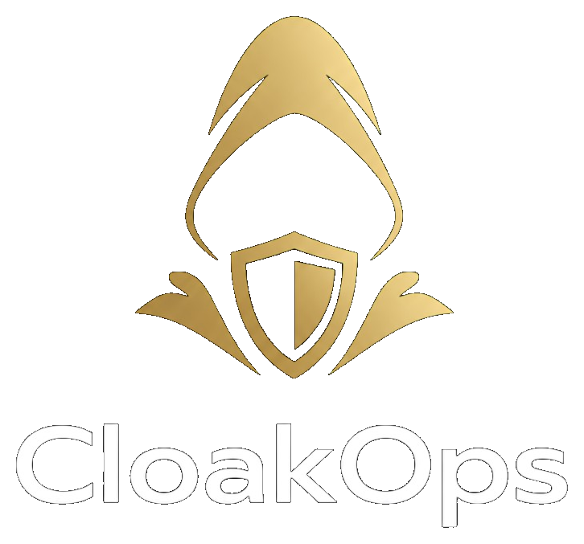

<p align="center">
  
</p>

<p align="center"><strong>Private allocations. Public rules. TokenOps execution.</strong></p>

CloakOps is a **confidential campaign layer for TokenOps**, built on **Zama FHE**.
Token teams run private rounds, contributor rewards, advisor vesting, and
community distributions where **allocation amounts, tiers, and vesting metadata
stay encrypted on-chain** — while **campaign rules and totals remain publicly
verifiable**.

> Built for the Zama Developer Program (Mainnet Season 3) — **Builder Track**
> and the **TokenOps Special Bounty**.

### Submission links

| | Link |
| --- | --- |
| **Live demo** | [cloak-ops.vercel.app](https://cloak-ops.vercel.app/) |
| **Video demo** | _Add your Loom / YouTube URL_ |
| **ConfidentialCampaign (Sepolia)** | [`0x8bE1…aF7e`](https://sepolia.etherscan.io/address/0x8bE1695FEa146cBb84d292d68f7682D118a0aF7e) |
| **TokenOps funding (example tx)** | [`0x3de4…2cd9e`](https://sepolia.etherscan.io/tx/0x3de4905d8b5dcd3cfada7d51ddffecf54710c07fe1c6661ddc4e1bac1ef2cd9e) |

Full submission pack (pitch, demo order, checklist): [`docs/SUBMISSION.md`](docs/SUBMISSION.md).

---

## The problem

Public chains leak distribution strategy. Anyone can read token transfers and
vesting contracts to infer who got the biggest allocation, which contributors
are top-tier, what advisors received, and when each party claimed.

Ordinary encryption doesn't solve it: you can't run claim logic or prove
campaign totals over data nobody can compute on.

## The solution

**Fully Homomorphic Encryption (FHE)** lets a smart contract operate on
encrypted values directly. CloakOps stores each recipient's allocation
(`euint64`), tier (`euint8`), and vesting class (`euint8`) encrypted, with
per-recipient FHE access control so **only the recipient can decrypt their own
values**. On claim, the still-encrypted allocation is credited to the
recipient's confidential token balance via an on-chain **`FHE.add`** — the
payout amount is never revealed publicly.

TokenOps provides the **campaign and distribution lifecycle rail**; CloakOps
adds the **confidential metadata layer**.

### How the two settlement rails relate

CloakOps drives **two complementary, confidential settlement paths from the same
encrypted allocation** — neither ever reveals the amount publicly:

| | CloakOps confidential claim | TokenOps confidential vesting |
| --- | --- | --- |
| Contract | `CloakConfidentialToken` (`FHE.add`) | TokenOps `…CliffExecutorConfidentialFactory` |
| Trigger | Recipient calls `claim()` | Admin runs the create flow |
| Effect | Credits recipient's encrypted balance instantly | Deploys + funds a per-recipient vesting wallet that releases on a schedule |
| Amount privacy | `euint64`, recipient-decryptable only | `euint64` encrypted in-browser before funding |

The encrypted allocation in `ConfidentialCampaign.sol` is the **single source of
truth**; the claim rail proves the FHE payout primitive end-to-end, while the
TokenOps rail proves the same encrypted amount can drive real, schedule-based
vesting wallets. On-chain proof: [`docs/tokenops-integration.md`](docs/tokenops-integration.md#verifiable-on-chain-proof).

---

## Why both tracks

| Track | What CloakOps demonstrates |
| --- | --- |
| **Zama Builder Track** | End-to-end FHE dApp: client encrypt → on-chain `euint64`/`euint8` storage → recipient `userDecrypt` → claim payout via `FHE.add` on `CloakConfidentialToken`. Deployed on Sepolia with the Zama Relayer SDK. |
| **TokenOps Special Bounty** | Real on-chain integration with the TokenOps confidential vesting factory: `createVestingWalletConfidential` (deploy) + `batchFundVestingWalletConfidential` (fund) with **browser-encrypted `euint64` amounts**, batched through Multicall3 so signatures stay fixed regardless of stakeholder count, plus a live operation log in the UI. See [`docs/tokenops-integration.md`](docs/tokenops-integration.md). |

### What CloakOps adds to TokenOps

CloakOps is a **product extension on top of TokenOps confidential vesting**, not
a parallel reimplementation:

- **A metadata layer the TokenOps UI doesn't expose** — confidential, per-recipient
  **tier (`euint8`)** and **vesting class (`euint8`)** alongside the encrypted
  allocation, with FHE access control so only each recipient can decrypt their own
  row. TokenOps moves the tokens; CloakOps encodes *who they are and on what terms*,
  confidentially.
- **Past the UI's single-stakeholder cap** — the dashboard wizard funds one
  stakeholder at a time, so CloakOps calls the same factory **directly** and batches
  **many** stakeholders (deploy + fund) through Multicall3 in a fixed signature
  count — the multi-recipient flow the UI can't yet do, on the contract that can.
- **A confidential campaign front-end + public audit page** — admins run encrypted
  campaigns and anyone can verify public rules (budget, window, claimed count) while
  every allocation stays encrypted, end to end.

---

## Privacy model

| Public & verifiable | Encrypted (Zama FHE) | Honestly not hidden (MVP) |
| --- | --- | --- |
| Campaign name & type | Allocation amount (`euint64`) | Recipient wallet addresses |
| Total budget | Recipient tier (`euint8`) | Transaction timing |
| Recipient count | Vesting class (`euint8`) | Admin address |
| Claim window | Confidential token balance (`euint64`) | |
| Claimed count | (decryptable only by recipient) | |
| Contract address | | |

Full detail: [`docs/privacy-model.md`](docs/privacy-model.md).

Architecture deep dive: [`docs/architecture.md`](docs/architecture.md).

---

## Quick start

### Prerequisites

- Node.js >= 20, npm >= 9
- MetaMask (or compatible wallet) on **Sepolia** with test ETH

### Install & run

```bash
npm install
npm run dev
# → http://localhost:3000
```

Configure the frontend env first — copy [`.env.example`](.env.example) to
`apps/web/.env.local` and fill in the deployed contract addresses (see
[Sepolia deployments](#sepolia-deployments) below).

### End-to-end flow

1. **`/admin`** — connect admin wallet on Sepolia → add recipients via the
   **form** (or paste/upload CSV) → *Create confidential campaign*. Watch the
   5-step flow: parse → Zama encrypt → contract submit → TokenOps sync → ready.
   Each on-chain step prompts a wallet signature.
2. **`/claim`** — connect a **recipient** wallet → the page auto-scans the
   contract for eligible campaigns → decrypt allocation/tier/vesting →
   *Claim allocation* → decrypt your **confidential token balance** (credited
   via on-chain `FHE.add`).
3. **`/public-audit`** — anyone can browse all campaigns read directly from
   Sepolia (works in incognito — no localStorage required) and verify public
   rules while private fields stay encrypted.

---

## Contracts

```bash
npm run compile      # Solidity 0.8.27, cancun, viaIR
npm run test         # 20 FHEVM mock-mode tests
```

### Deploy to Sepolia

Root `.env` (Hardhat only — see [Environment](#environment)):

```bash
npm run deploy:sepolia   # ConfidentialCampaign + CloakConfidentialToken
npm run export-abi       # sync ABI + addresses → apps/web/lib/contracts
```

Then update `apps/web/.env.local`:

```env
NEXT_PUBLIC_CLOAKOPS_CONTRACT_ADDRESS=0x...
NEXT_PUBLIC_CLOAKOPS_TOKEN_ADDRESS=0x...
NEXT_PUBLIC_TOKENOPS_VESTING_FACTORY=0x98c519f9de1dc8c8cb3eb9b0b09b3ce057beb72a
NEXT_PUBLIC_TOKENOPS_VESTING_TOKEN=0xFaac272CDE1701479932935a3567652873c377EF
NEXT_PUBLIC_WALLETCONNECT_PROJECT_ID=...
ZAMA_RELAYER_URL=https://relayer.testnet.zama.org/v2
```

### Sepolia deployments

| Component | Address / link |
| --- | --- |
| `ConfidentialCampaign` | `0x8bE1695FEa146cBb84d292d68f7682D118a0aF7e` |
| `CloakConfidentialToken` (cCLOAK) | `0x83e62cB81240dc73d7d3e2d812E5559EA0435376` |
| TokenOps vesting factory | `0x98c519f9de1dc8c8cb3eb9b0b09b3ce057beb72a` |
| TokenOps vesting token (CTestToken) | `0xFaac272CDE1701479932935a3567652873c377EF` |

---

## Smart contracts (summary)

**`ConfidentialCampaign.sol`** — campaign metadata + encrypted per-recipient
allocations + claim logic. On `claim()`, grants transient FHE access to the
campaign token and credits the recipient's encrypted balance.

**`CloakConfidentialToken.sol`** — ERC-7984-style confidential balance token;
`creditConfidential` performs `FHE.add` so running balances stay encrypted.

Full contract + frontend architecture: [`docs/architecture.md`](docs/architecture.md).

---

## Deploy the frontend (Vercel)

- **Root directory:** `apps/web`
- **Env vars:** all `NEXT_PUBLIC_*` from `.env.local`, plus server-side
  `ZAMA_RELAYER_URL` (relayer proxy at `/api/relayer/[chainId]`)
- Do **not** put `PRIVATE_KEY` in Vercel

---

## Environment

| File | Purpose |
| --- | --- |
| **Root `.env`** | Hardhat deploy only: `SEPOLIA_RPC_URL`, `PRIVATE_KEY`, `ETHERSCAN_API_KEY` |
| **`apps/web/.env.local`** | Next.js frontend: contract addresses, TokenOps, WalletConnect, relayer |

Template: [`.env.example`](.env.example). No secrets are committed (both files are gitignored).

---

## Limitations & roadmap

- Claim credits a confidential `euint64` balance in `CloakConfidentialToken`
  (testnet demo asset); it does not move pre-funded production tokens.
- Recipient addresses, tx timing, and the admin address are visible on-chain.
- **Roadmap:** production ERC-7984 settlement via TokenOps rails, encrypted
  vesting enforcement on-chain, multi-admin campaigns.

## Out of scope

ERC-20↔ERC-7984 wrapper registry, wrap/unwrap UI, payroll, governance,
cross-chain, billing, KYC, mainnet deployment.

## License

MIT
