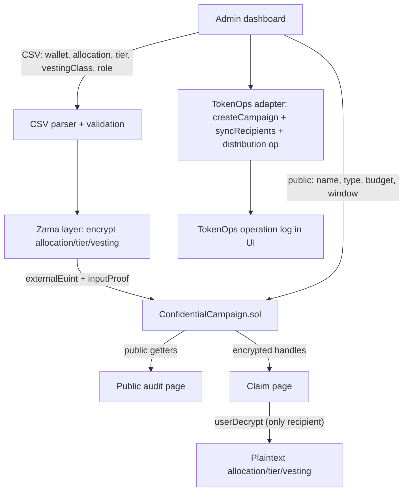

# Architecture

CloakOps is a monorepo (npm workspaces) with two packages: the Solidity
contracts and the Next.js web app, plus shared docs.

## High-level data flow

## Components

### Smart contracts (`packages/contracts`)

- **`ConfidentialCampaign.sol`** — inherits `ZamaEthereumConfig` from
  `@fhevm/solidity`. Stores a public `PublicCampaign` struct and a per-recipient
  encrypted `EncryptedAllocation { euint64 amount; euint8 tier; euint8
  vestingClass; bool eligible; bool claimed; }`. Encrypted inputs arrive as
  `externalEuint64` / `externalEuint8` + an `inputProof`, are converted via
  `FHE.fromExternal`, and are authorized with `FHE.allowThis` (contract) +
  `FHE.allow(handle, recipient)` (recipient).
- **`MockConfidentialToken.sol`** — a plain ERC-20 used only as the campaign
  token reference in demos/tests.
- Compiled with Solidity `0.8.27`, `evmVersion: "cancun"`, `viaIR: true`
  (required for FHE-heavy stack depth), optimizer on.

### Frontend (`apps/web`)

- **Next.js App Router** + TypeScript + Tailwind CSS.
- **wagmi + viem** for wallet connection (custom injected/WalletConnect
  connector, no RainbowKit to keep the wagmi v2 dependency graph clean).
- **`lib/zama`** — `ZamaProvider` interface with `DemoZamaProvider`
  (deterministic local FHE simulation) and `RealZamaProvider` (Zama Relayer SDK,
  dynamically imported). `useZama()` selects the provider by `NEXT_PUBLIC_ZAMA_MODE`.
- **`lib/tokenops`** — `TokenOpsCampaignAdapter` interface with
  `DemoTokenOpsAdapter` and `RealTokenOpsAdapter` (`@tokenops/sdk` fhe-airdrop,
  dynamically imported). `TokenOpsProvider` (React context) exposes status, the
  operation log, and wrapped lifecycle methods.
- **`lib/campaigns`** — a localStorage-backed reactive campaign store
  (`useSyncExternalStore`), the `runCreateCampaign` orchestrator that streams
  the 5-step flow, and hooks (`useCampaigns`, `useCampaign`) plus demo seeding.
- **`lib/csv`** — Papaparse-based parser with euint64/euint8 validation.
- **`lib/contracts`** — ABI + typed bindings exported from the contracts package.
- **`app/api/relayer/[chainId]`** — server-side proxy that injects the relayer
  API key, so the browser never holds secrets.

## Pages

- **`/`** — landing: hero, problem/solution, privacy split, track fit.
- **`/admin`** — create campaign: form + CSV upload + demo loader + the 5-step
  confidential creation flow + live TokenOps panel + Zama status.
- **`/claim`** — eligibility + decrypt own allocation/tier/vesting + claim, with
  a "add my wallet to the demo campaign" affordance.
- **`/public-audit/[id]`** — public, verifiable state + explicit hidden-fields
  list + recipients ledger (addresses visible, values locked) + TokenOps status.
- **`/campaign/[id]`** — combined detail with role-aware panels (admin /
  recipient / public viewer), timeline, contract links, and the op log.

## Modes

| Layer | Demo (default) | Real |
| --- | --- | --- |
| FHE | deterministic local encrypt/decrypt | Zama Relayer SDK vs deployed contract |
| TokenOps | faithful lifecycle simulation | `@tokenops/sdk` confidential airdrop |
| Contract writes | recorded locally | wagmi/viem on-chain (when configured) |

This guarantees a flawless demo with zero external dependencies, while keeping a
real, deploy-ready path.
