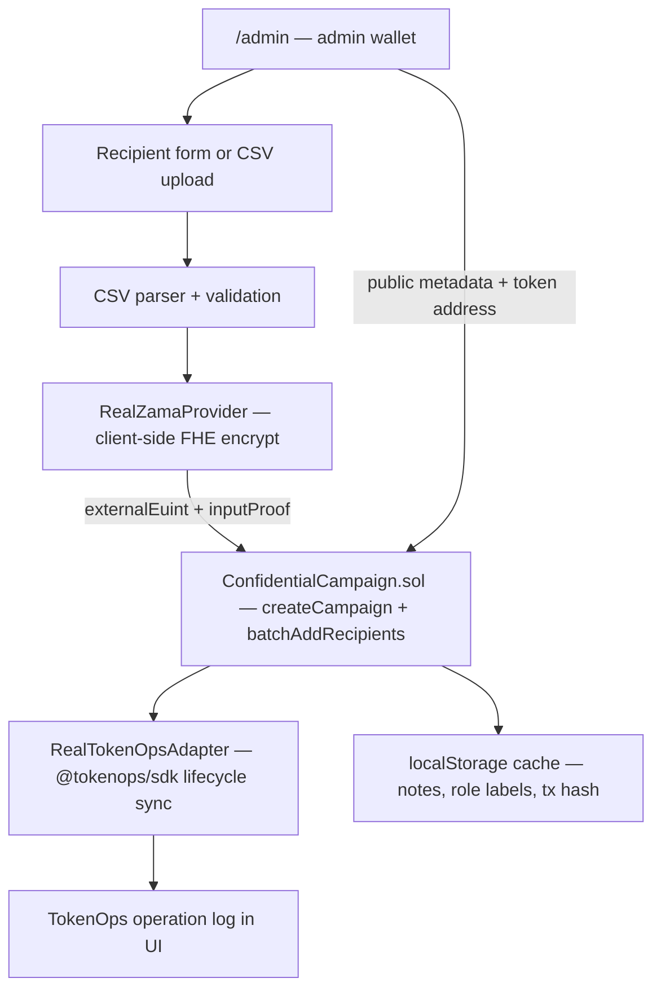
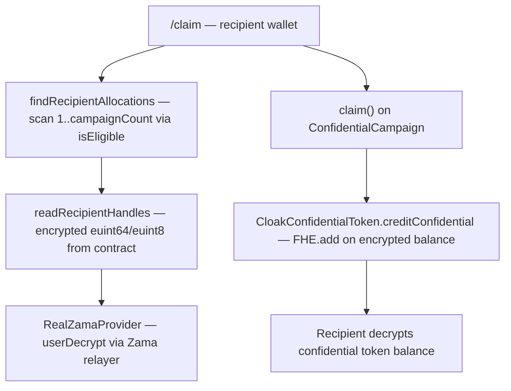
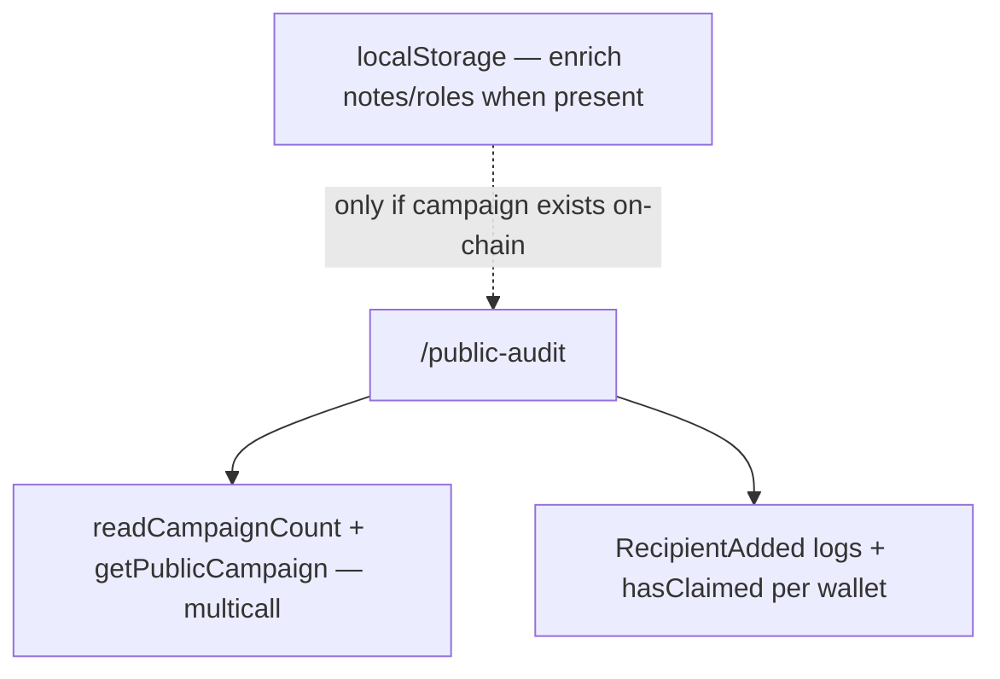

# Architecture

CloakOps is an npm-workspaces monorepo: a Next.js frontend (`apps/web`) and
Hardhat contracts package (`packages/contracts`), plus shared docs. Everything
runs against **live Sepolia infrastructure** — Zama Relayer SDK, deployed FHE
contracts, and TokenOps distribution rails. There is no simulated demo fallback.

---

## High-level data flow

### Admin: create a confidential campaign



### Recipient: claim



### Public audit: verify rules without seeing deals



**Source of truth:** on-chain contract state. localStorage is a browser cache
for off-chain metadata (notes, role labels). Public audit and claim **never**
show campaigns that do not exist on the currently configured contract address.

---

## Repository layout

```
CloakOps/
├── apps/web/                    Next.js 14 App Router frontend
│   ├── app/
│   │   ├── page.tsx             Landing
│   │   ├── admin/               Campaign creation + 5-step flow
│   │   ├── claim/               Auto-scan eligibility + decrypt + claim
│   │   ├── public-audit/        On-chain campaign index
│   │   ├── public-audit/[id]/   On-chain detail + recipient ledger
│   │   ├── campaign/[id]/       Combined admin/recipient detail view
│   │   └── api/relayer/[chainId] Server-side Zama relayer proxy
│   ├── components/              UI, admin form/CSV, TokenOps panel, etc.
│   └── lib/
│       ├── zama/                RealZamaProvider (Relayer SDK)
│       ├── tokenops/            RealTokenOpsAdapter (@tokenops/sdk)
│       ├── campaigns/           create-flow, store, hooks, onchain.ts
│       ├── contracts/           ABI, read/write helpers
│       ├── csv/                 Papaparse allocation parser
│       ├── sample/              Sample CSV dataset for admin
│       └── wagmi/               Wallet + on-chain client resolution
├── packages/contracts/
│   ├── contracts/
│   │   ├── ConfidentialCampaign.sol
│   │   └── CloakConfidentialToken.sol
│   ├── test/                    FHEVM mock-mode tests (13 passing)
│   └── scripts/                 deploy.ts, export-abi.ts
└── docs/                        architecture, privacy-model, tokenops-integration, …
```

---

## Smart contracts (`packages/contracts`)

### `ConfidentialCampaign.sol`

Inherits `ZamaEthereumConfig` from `@fhevm/solidity`.

| Struct | Visibility | Contents |
| --- | --- | --- |
| `PublicCampaign` | public | name, type, budget, recipient/claimed counts, claim window, token, admin |
| `EncryptedAllocation` | encrypted per recipient | `euint64 amount`, `euint8 tier`, `euint8 vestingClass`, eligible, claimed |

**Key functions:**

- `createCampaign(...)` — stores public metadata; returns incrementing `campaignId`.
- `addRecipient` / `batchAddRecipients` — converts `externalEuint*` + `inputProof`
  via `FHE.fromExternal`; grants ACL with `FHE.allowThis` + `FHE.allow(recipient)`.
- `claim(campaignId)` — validates window + eligibility; marks claimed (public
  `claimedCount++`); calls `CloakConfidentialToken.creditConfidential` with
  `FHE.allowTransient` so the payout amount stays encrypted through an on-chain
  `FHE.add`.
- View getters: `getPublicCampaign`, `isEligible`, `hasClaimed`,
  `getEncryptedAllocation/Tier/VestingClass`.

Compiled with Solidity **0.8.27**, `evmVersion: cancun`, `viaIR: true`, optimizer on.

### `CloakConfidentialToken.sol`

ERC-7984-style confidential balance token for testnet settlement.

- Balances stored as `euint64` handles in a mapping.
- `creditConfidential(to, amount)` — `FHE.add` onto the recipient's encrypted balance.
- `confidentialBalanceOf(account)` — returns handle; only the owner can decrypt.

On mainnet this slot would be a production confidential token managed via
TokenOps distribution rails.

---

## Frontend (`apps/web`)

### Zama layer (`lib/zama`)

- **`RealZamaProvider`** — wraps `@zama-fhe/sdk` / `RelayerWeb`.
- **`encryptBatch`** — client-side FHE encryption before `batchAddRecipients`.
- **`decryptValue`** — recipient-only `userDecrypt` (EIP-712 signature).
- Relayer URL resolves to an absolute URL for Web Worker contexts; falls back
  from the Next.js proxy (`/api/relayer/[chainId]`) to the direct Zama relayer.

### TokenOps layer (`lib/tokenops`)

- **`RealTokenOpsAdapter`** — drives the TokenOps confidential-vesting factory
  (`createVestingWalletConfidential` + `batchFundVestingWalletConfidential`).
- The campaign's "TokenOps vesting" link points to the on-chain funding tx
  (`VestingWalletConfidentialFunded`) on Etherscan — the verifiable proof.
- **`syncRecipients`** receives wallet addresses only — never plaintext amounts.
- **`TokenOpsProvider`** (React context) exposes connection status + operation log.

See [`tokenops-integration.md`](tokenops-integration.md) for adapter details.

### Campaign orchestration (`lib/campaigns`)

| Module | Role |
| --- | --- |
| `create-flow.ts` | 5-step orchestrator: parse → encrypt → submit → TokenOps → ready |
| `store.ts` | localStorage cache (`cloakops.campaigns.v1`) |
| `hooks.ts` | `useCampaigns`, `useCampaign` |
| `onchain.ts` | `useAllCampaigns`, `useCampaignOrChain` — on-chain reads merged with local enrichment |

### On-chain helpers (`lib/contracts`)

| Function | Used by |
| --- | --- |
| `readAllPublicCampaigns` | `/public-audit` index |
| `readCampaignRecipients` | `/public-audit/[id]` ledger (from `RecipientAdded` events) |
| `findRecipientAllocations` | `/claim` auto-scan |
| `readConfidentialBalance` | `/claim` post-claim balance display |
| `createCampaignOnChain`, `batchAddRecipientsOnChain`, `claimOnChain` | Admin + claim writes |

### Wallet (`lib/wagmi`)

- **`resolveOnChainClients`** — `getWalletClient` + chain switch to Sepolia;
  ensures `writeContract` is available before any on-chain transaction.

---

## Pages

| Route | Audience | Data source |
| --- | --- | --- |
| `/` | Everyone | Static |
| `/admin` | Campaign admin | Form/CSV → encrypt → chain → TokenOps; 5-step progress UI |
| `/claim` | Recipients | On-chain scan (`isEligible`); decrypt + claim + confidential balance |
| `/public-audit` | Auditors | On-chain `getPublicCampaign` for all campaigns |
| `/public-audit/[id]` | Auditors | On-chain metadata + event-based recipient ledger |
| `/campaign/[id]` | Admin / recipient / viewer | Merged local + on-chain detail |

---

## Environment

Two env files — do not mix them up:

| File | Read by | Contains |
| --- | --- | --- |
| **Root `.env`** | Hardhat only (`hardhat.config.ts`) | `SEPOLIA_RPC_URL`, `PRIVATE_KEY`, `ETHERSCAN_API_KEY` |
| **`apps/web/.env.local`** | Next.js frontend | `NEXT_PUBLIC_*` contract/token addresses, TokenOps vesting URLs, WalletConnect, `ZAMA_RELAYER_URL` |

See [`.env.example`](../.env.example) for the full template.

---

## Sepolia deployments (current)

| Component | Address |
| --- | --- |
| `ConfidentialCampaign` | `0x2aC73986D461421A13DAC1A113EfE1A6e1F003e4` |
| `CloakConfidentialToken` (cCLOAK) | `0xdba250e6E6b7e6CC79C673eb565Be2ef4D7493E9` |
| TokenOps vesting factory | `0x98c519f9de1dc8c8cb3eb9b0b09b3ce057beb72a` |
| TokenOps vesting token (CTestToken) | `0xFaac272CDE1701479932935a3567652873c377EF` |

After redeploying contracts, run `npm run export-abi` and update
`apps/web/.env.local` with the new addresses.

---

## Related docs

- [`privacy-model.md`](privacy-model.md) — what is encrypted vs public vs visible
- [`tokenops-integration.md`](tokenops-integration.md) — TokenOps adapter + SDK spike
- [`video-script.md`](video-script.md) — demo recording script
